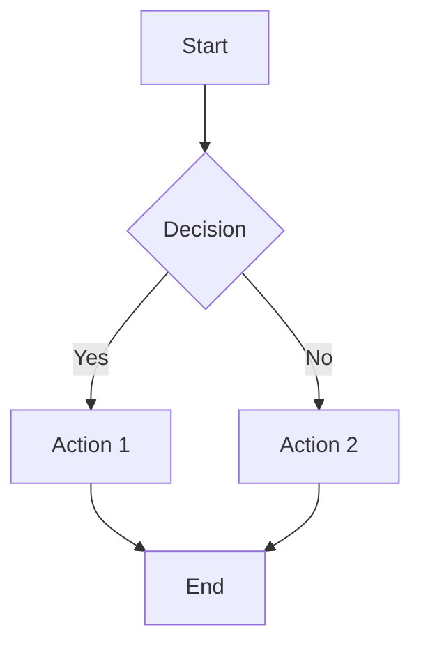
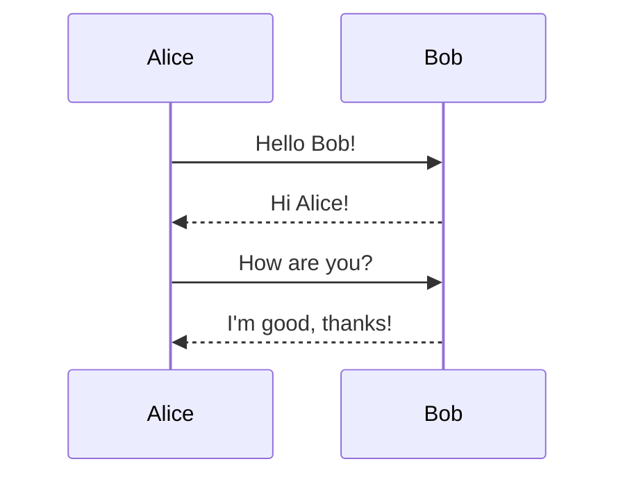
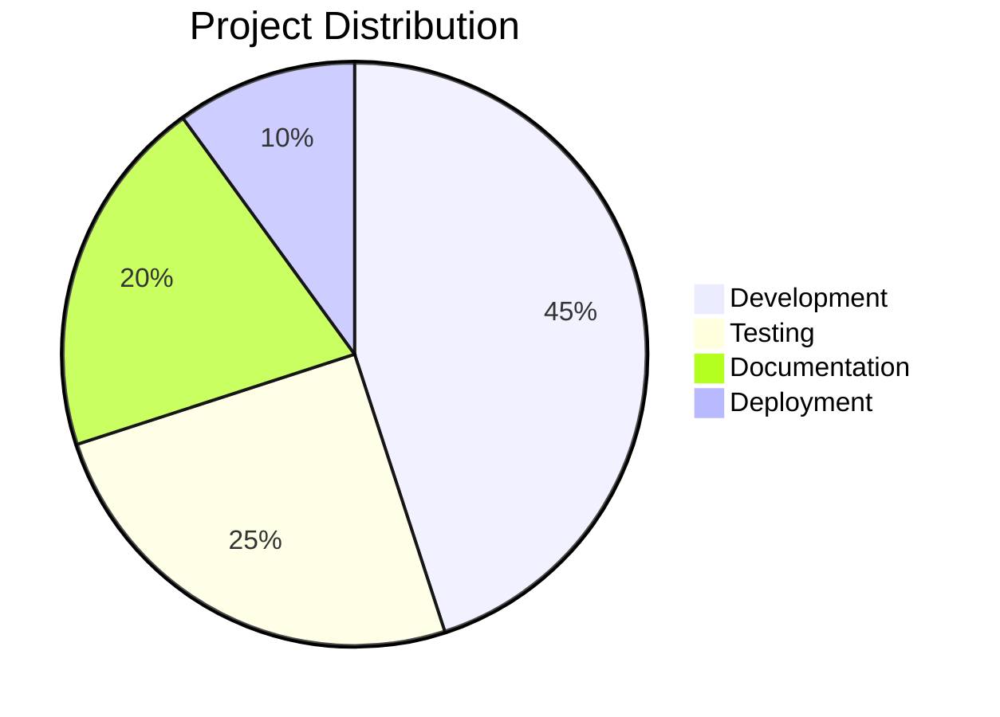
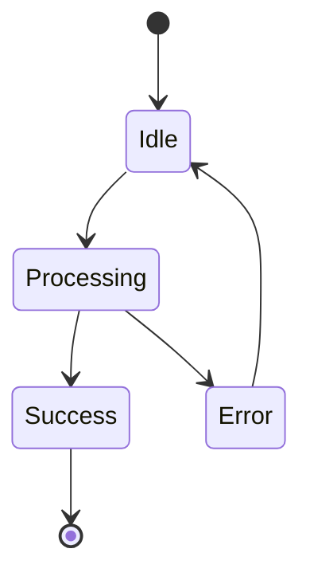
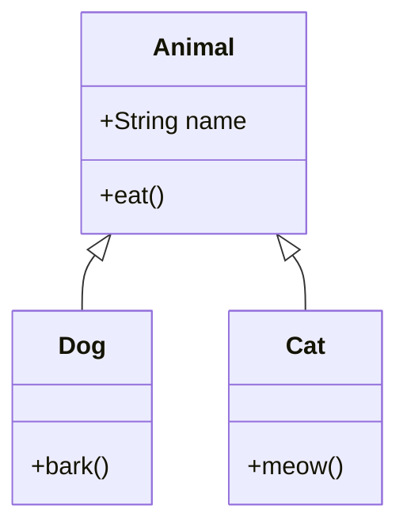
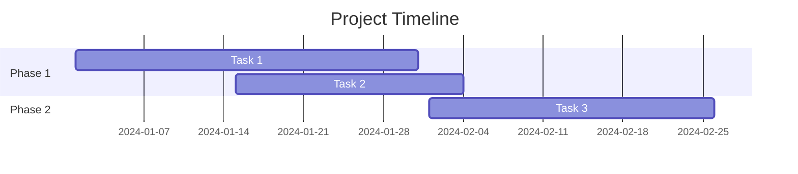

# 📝 Editor Features - MindNote

## Fitur Editor yang Telah Ditambahkan

### 1. ✅ Markdown-First
- Plain text sebagai format utama
- Full Markdown support dengan GFM (GitHub Flavored Markdown)
- Real-time preview mode

### 2. ⬅➡ Split View
- **Tombol Split View** (⬅➡) di header editor
- Editor di sebelah kiri, preview di sebelah kanan
- Synchronous scrolling antara editor dan preview
- Responsive: otomatis vertical stack di mobile

### 3. 🎨 Syntax Highlighting
- **20+ bahasa pemrograman** didukung via highlight.js
- Auto-detection untuk code blocks tanpa bahasa
- Theme: VS2015 (dark theme)
- Cara pakai: \`\`\`javascript ... \`\`\`

Bahasa yang didukung:
- JavaScript, TypeScript, Python, Java, C++, C#
- Go, Rust, PHP, Ruby, Swift, Kotlin
- HTML, CSS, SQL, Shell/Bash
- Dan banyak lagi!

### 4. 🧮 Math Support (LaTeX/KaTeX)
- **Inline math**: `$E = mc^2$` → $E = mc^2$
- **Block math**: `$$\sum_{i=1}^n i = \frac{n(n+1)}{2}$$`
- Rendering cepat dengan KaTeX
- Error handling yang ramah

Contoh:
```markdown
Inline: $\alpha + \beta = \gamma$

Block:
$$
\int_{-\infty}^{\infty} e^{-x^2} dx = \sqrt{\pi}
$$
```

### 5. ✅ Checklist & Tables
**Checklist:**
```markdown
- [x] Task yang sudah selesai
- [ ] Task yang belum selesai
- [ ] Task lainnya
```

**Tables:**
```markdown
| Header 1 | Header 2 | Header 3 |
|----------|----------|----------|
| Cell 1   | Cell 2   | Cell 3   |
| Cell 4   | Cell 5   | Cell 6   |
```

### 6. 📊 Mermaid Diagrams
Support untuk berbagai jenis diagram:

**Flowchart:**


**Sequence Diagram:**


**Pie Chart:**


**State Diagram:**


**Class Diagram:**


**Gantt Chart:**


### 7. 📁 Drag & Drop Image/File
- **Drag & drop** file langsung ke editor
- **Image files** → otomatis embed sebagai ``
- **Other files** → embed sebagai link `[📎 filename](base64)`
- Visual feedback saat dragging
- Support multiple files sekaligus

## Cara Menggunakan

### Mode Editor
1. **Edit Mode**: Mode default untuk menulis
2. **Preview Mode** (👁️): Lihat hasil render markdown
3. **Split View** (⬅➡): Edit dan preview bersamaan

### Keyboard Shortcuts di Editor
- `Tab`: Indent
- `Shift+Tab`: Outdent
- Copy/Paste: Standard shortcuts
- Drag & Drop: Langsung drop file ke editor

### Tips & Tricks
1. Gunakan **split view** untuk melihat hasil real-time saat menulis
2. Code blocks dengan bahasa spesifik akan di-highlight otomatis
3. Math equations mendukung semua sintaks LaTeX/KaTeX
4. Mermaid diagrams akan render otomatis di preview
5. Drag & drop gambar untuk embed cepat tanpa upload manual

## Package yang Digunakan

### Core Dependencies
- `marked@16.3.0` - Markdown parser
- `highlight.js@11.11.1` - Syntax highlighting
- `katex@0.16.22` - Math rendering
- `mermaid@11.12.0` - Diagram rendering
- `dompurify@3.2.7` - HTML sanitization

### Build Tools
- `svelte@5.39.8` - Framework
- `vite@7.1.9` - Build tool
- `typescript@5.9.3` - Type checking
- `tailwindcss@4.1.14` - CSS framework
- `@tailwindcss/postcss@4.1.14` - PostCSS plugin

## Performance Notes
- Mermaid library cukup besar (~2.3MB), tapi di-lazy load
- KaTeX rendering sangat cepat (<1ms per equation)
- highlight.js support 180+ bahasa tapi hanya load yang digunakan
- Split view menggunakan single DOM update untuk efisiensi

## Browser Support
- Chrome/Edge 90+
- Firefox 88+
- Safari 14+
- Opera 76+

## Fitur Tambahan yang Sudah Ada
- 📱 Responsive mobile support
- 🌙 Dark/Light/Typewriter themes
- 🔗 Cross-note linking `[[note-title]]`
- 📌 Pin notes
- 🔍 Search functionality
- 💾 Auto-save dengan debouncing
- 📊 Word count & statistics
- 📎 Attachment manager
- 📄 PDF viewer
- 📊 CSV viewer
- 🔄 Export/Import notes

## Troubleshooting

### Mermaid diagram tidak render?
- Pastikan syntax Mermaid benar
- Check console untuk error messages
- Coba reload page

### Math tidak render?
- Pastikan menggunakan `$...$` untuk inline atau `$$...$$` untuk block
- Check syntax LaTeX/KaTeX
- Lihat [KaTeX documentation](https://katex.org/docs/supported.html)

### Syntax highlighting tidak muncul?
- Pastikan bahasa yang digunakan didukung
- Format: \`\`\`language ... \`\`\`
- Coba tanpa spesifikasi bahasa untuk auto-detection
