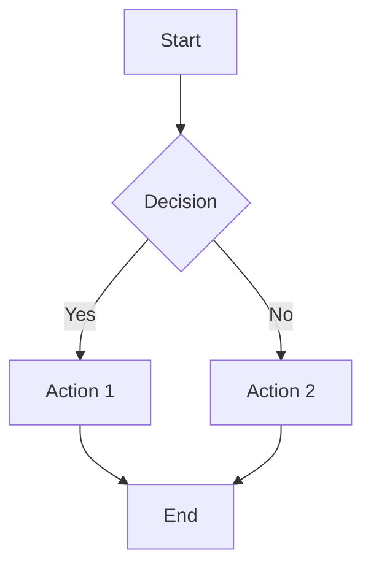
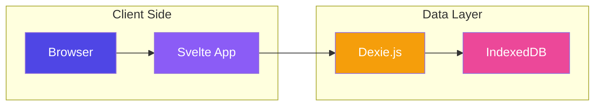
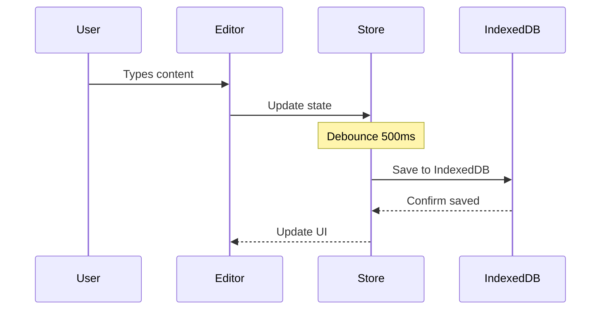
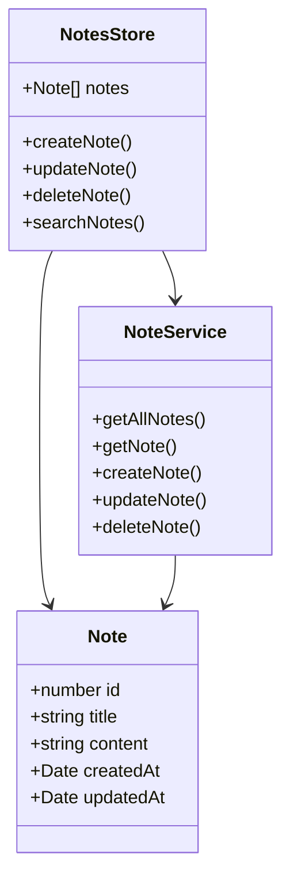
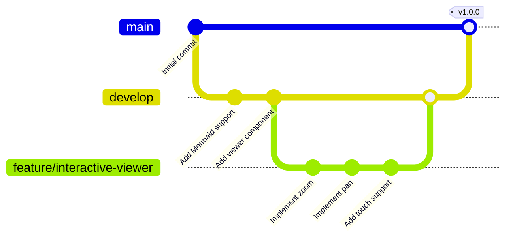
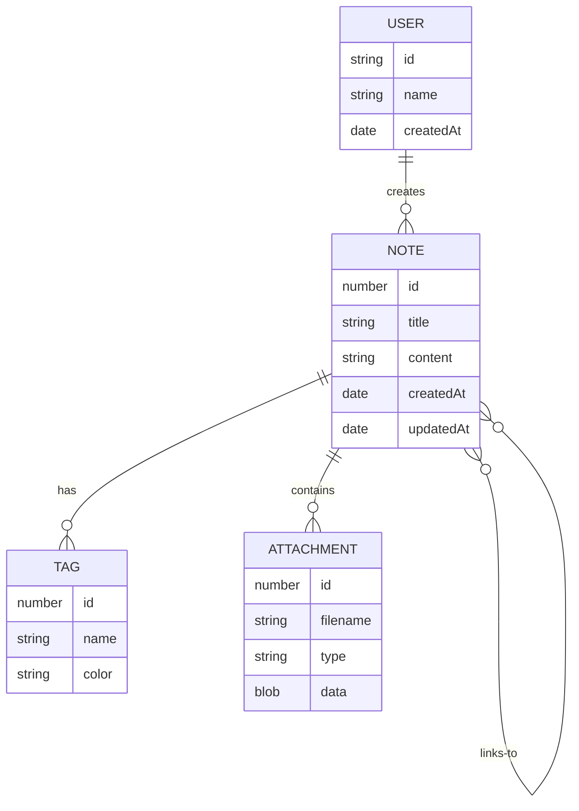
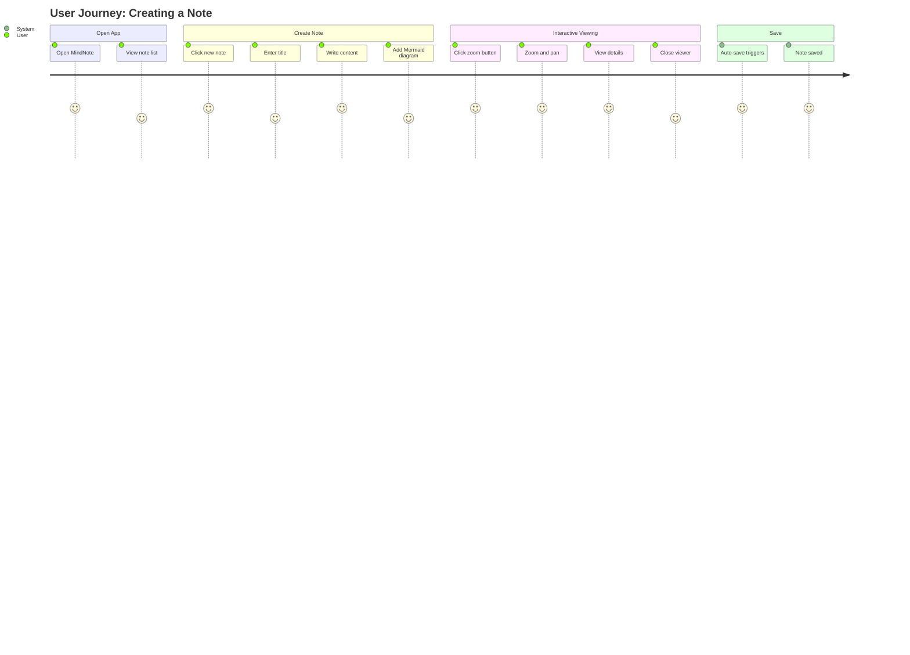
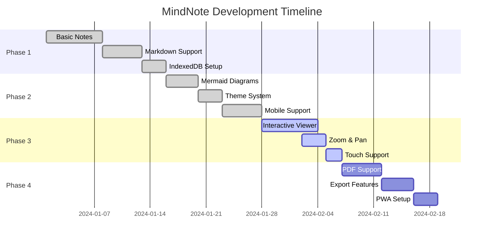

# 🎨 Mermaid Diagram Interactive Viewer - Demo

Selamat datang! Ini adalah demo untuk fitur **Interactive Mermaid Viewer** yang baru. Klik tombol **Zoom** di pojok kanan atas setiap diagram untuk membuka viewer interaktif.

## 📊 Diagram 1: Simple Flowchart

## 🏗️ Diagram 2: System Architecture

## 🔄 Diagram 3: State Management Flow

## 🗂️ Diagram 4: Class Diagram

## 🚀 Diagram 5: Git Flow

## 📈 Diagram 6: Entity Relationship

## 🧭 Diagram 7: User Journey

## 🎯 Diagram 8: Gantt Chart

## 🎮 How to Use

### Desktop
1. **Zoom**: 
   - Click zoom button on diagram
   - Use mouse wheel to zoom in/out
   - Press `+` or `-` keys
2. **Pan**: 
   - Click and drag the diagram
3. **Reset**: 
   - Click reset button
   - Press `0` key
4. **Close**: 
   - Click close button (X)
   - Press `Esc` key
   - Click outside the viewer

### Mobile
1. **Zoom**: 
   - Tap zoom button on diagram
   - Use pinch gesture (two fingers)
2. **Pan**: 
   - Swipe with one finger
3. **Reset**: 
   - Tap reset button
4. **Close**: 
   - Tap close button (X)
   - Tap outside the viewer

## 🌟 Features

✅ **Smooth Zoom**: Scale from 50% to 500%  
✅ **Pan Navigation**: Drag to explore large diagrams  
✅ **Touch Support**: Pinch zoom and touch pan  
✅ **Keyboard Shortcuts**: Fast navigation with keyboard  
✅ **Fullscreen Mode**: Distraction-free viewing  
✅ **Dark Mode**: Matches your theme preference  
✅ **Responsive**: Works on all screen sizes  
✅ **Accessible**: ARIA labels and keyboard support  

## 💡 Pro Tips

1. **Large Diagrams**: Zoom out first to see the overview, then zoom in to details
2. **Quick Reset**: Press `0` to quickly return to default view
3. **Smooth Scrolling**: Use mouse wheel for precise zoom control
4. **Mobile Zoom**: Use two fingers for more accurate zoom control
5. **Keyboard Navigation**: Fastest way for repeated zooming

---

**Enjoy exploring your diagrams! 🚀**
