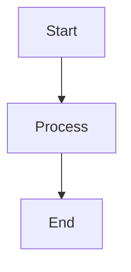

# Mermaid Diagram Interactive Viewer Feature

## 📋 Overview
Fitur viewer interaktif untuk diagram Mermaid yang memungkinkan pengguna untuk zoom in/out, pan/drag, dan navigasi yang lebih baik baik di desktop maupun mobile.

## ✨ Features

### 1. **Interactive Zoom Controls**
- **Zoom In/Out**: Tombol + dan - untuk kontrol zoom
- **Mouse Wheel**: Scroll untuk zoom dengan presisi
- **Keyboard Shortcuts**: 
  - `+` atau `=` untuk zoom in
  - `-` untuk zoom out
  - `0` untuk reset ke posisi awal
  - `Esc` untuk menutup viewer

### 2. **Pan/Drag Navigation**
- **Mouse Drag**: Klik dan drag untuk menggeser diagram
- **Touch Pan**: Single touch untuk pan di mobile
- Smooth cursor transitions (grab → grabbing)

### 3. **Mobile Touch Support**
- **Pinch to Zoom**: Dua jari untuk zoom in/out
- **Touch Pan**: Satu jari untuk menggeser diagram
- **Touch-optimized UI**: Tombol dan instruksi disesuaikan untuk layar sentuh
- **Prevent Default Behaviors**: `touch-action: none` untuk kontrol penuh

### 4. **User Interface**
- **Zoom Button pada Diagram**: Setiap diagram Mermaid memiliki tombol "Zoom" di pojok kanan atas
- **Fullscreen Overlay**: Viewer membuka dalam mode overlay fullscreen
- **Control Panel**: 
  - Zoom in/out buttons
  - Reset button
  - Close button
  - Zoom percentage display
- **Visual Instructions**: Panduan cepat untuk navigasi
- **Smooth Animations**: Fade in dan slide up animations

### 5. **Responsive Design**
- **Desktop**: 95vw x 95vh dengan max-width 1600px
- **Mobile**: Full screen (100vw x 100vh)
- **Adaptive Controls**: Tombol dan teks menyesuaikan ukuran layar
- **Hidden Instructions**: Keyboard shortcuts disembunyikan di mobile

## 🎯 Technical Implementation

### File Structure
```
src/lib/
├── MermaidViewer.svelte      # Interactive viewer component
├── MarkdownPreview.svelte    # Updated with viewer integration
└── markdown.ts                # Updated render function with zoom callback
```

### Key Components

#### MermaidViewer.svelte
- **Props**: `svg: string`, `onClose?: () => void`
- **State Management**: 
  - Transform: `scale`, `translateX`, `translateY`
  - Pan state: `isPanning`, `startX`, `startY`
  - Touch state: `initialDistance`, `initialScale`
- **Constants**:
  - `MIN_SCALE = 0.5` (50%)
  - `MAX_SCALE = 5` (500%)
  - `ZOOM_STEP = 0.2` (20%)

#### Event Handlers
1. **Mouse Events**:
   - `handleMouseDown`: Inisiasi panning
   - `handleMouseMove`: Update posisi saat drag
   - `handleMouseUp`: Selesai panning
   - `handleWheel`: Zoom dengan mouse wheel

2. **Touch Events**:
   - `handleTouchStart`: Deteksi single/multi touch
   - `handleTouchMove`: Pan atau pinch zoom
   - `handleTouchEnd`: Cleanup state
   - `getTouchDistance`: Hitung jarak antar jari untuk pinch

3. **Keyboard Events**:
   - `handleKeyDown`: Shortcuts dan close

#### Transform Logic
```typescript
function updateTransform() {
  svgElement.style.transform = 
    `translate(${translateX}px, ${translateY}px) scale(${scale})`
  svgElement.style.transformOrigin = 'center center'
}
```

### markdown.ts Updates
```typescript
export async function renderMermaidDiagrams(
  container: HTMLElement, 
  onZoomClick?: (svg: string) => void
)
```
- Menerima optional callback `onZoomClick`
- Menambahkan tombol zoom pada setiap diagram
- Wrapper structure: `.mermaid-wrapper` → `.mermaid-svg-container` + `.mermaid-zoom-btn`

### MarkdownPreview.svelte Updates
- Import `MermaidViewer` component
- State untuk viewer: `viewerSvg`, `showViewer`
- Functions: `openViewer(svg)`, `closeViewer()`
- Conditional rendering viewer dengan `{#if showViewer}`

## 🎨 Styling

### Zoom Button
```css
.mermaid-zoom-btn {
  position: absolute;
  top: 0.5rem;
  right: 0.5rem;
  padding: 0.5rem 0.75rem;
  background: var(--primary-color);
  color: white;
  border-radius: 6px;
  box-shadow: 0 2px 8px rgba(0, 0, 0, 0.15);
}
```

### Viewer Overlay
```css
.mermaid-viewer-overlay {
  position: fixed;
  z-index: 9999;
  background: rgba(0, 0, 0, 0.85);
  backdrop-filter: blur(4px);
  animation: fadeIn 0.2s ease-out;
}
```

### SVG Container
```css
.svg-container {
  cursor: grab;
  touch-action: none;
  overflow: hidden;
}

.svg-container:active {
  cursor: grabbing;
}
```

## 📱 Mobile Optimizations

### Touch Handling
- `touch-action: none` mencegah browser default behaviors
- Pinch detection dengan `getTouchDistance()`
- Smooth transform updates tanpa jitter

### UI Adjustments
- Tombol lebih kecil (padding: 0.4rem)
- Font size dikurangi
- Instruksi keyboard disembunyikan
- Full screen tanpa border radius

### Performance
- `will-change: transform` untuk GPU acceleration
- Debounced transform updates
- Efficient event handling

## 🔧 Usage

### Dalam Markdown
```markdown
# My Diagram


```

### Interaksi User
1. **Melihat Diagram**: Diagram muncul di preview dengan tombol "Zoom"
2. **Klik Zoom**: Membuka fullscreen viewer
3. **Navigasi**:
   - Desktop: Drag mouse + scroll wheel
   - Mobile: Touch pan + pinch zoom
   - Keyboard: +/- untuk zoom, 0 untuk reset
4. **Tutup**: Klik tombol X, tekan Esc, atau klik background

## 🌈 Theme Support
- CSS variables untuk theming: `--bg-color`, `--card-bg`, `--border-color`
- Dark mode: Background overlay lebih gelap (`rgba(0, 0, 0, 0.9)`)
- Consistent dengan tema aplikasi

## ♿ Accessibility
- ARIA roles: `role="dialog"`, `role="img"`, `role="button"`
- `aria-label` pada SVG container
- Keyboard navigation support
- Focus management

## 🚀 Future Enhancements
- [ ] Pan to specific area dengan double click
- [ ] Fit to screen button
- [ ] Export diagram as PNG/SVG
- [ ] Multiple diagram comparison
- [ ] Annotations support
- [ ] Zoom limits adjustable per diagram

## 📝 Testing Checklist
- [x] Zoom in/out dengan mouse wheel
- [x] Pan dengan mouse drag
- [x] Pinch zoom di mobile
- [x] Touch pan di mobile
- [x] Keyboard shortcuts
- [x] Tombol zoom muncul di setiap diagram
- [x] Viewer fullscreen
- [x] Close dengan Esc/click background
- [x] Reset zoom
- [x] Responsive design
- [x] Dark mode support
- [x] Smooth animations

## 🐛 Known Issues
- Tidak ada (saat ini)

## 💡 Tips
1. **Diagram Besar**: Gunakan zoom out dahulu untuk melihat overview, lalu zoom in ke detail
2. **Mobile**: Gunakan dua jari untuk zoom yang lebih akurat
3. **Keyboard**: Shortcut paling cepat untuk zoom berulang
4. **Reset**: Gunakan tombol reset atau tekan "0" jika tersesat
